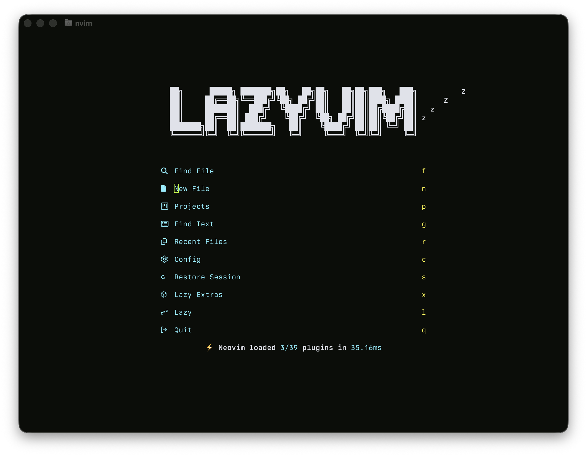

# whytwokay.nvim

A high-contrast **Y2K-era inspired** Neovim colorscheme - phosphor limes, glass blacks, and CRT blues tuned for *readability and retro-future glow*.




---

## ✨ Features
- Balanced neon palette - readable acid green & phosphor yellow without eye strain
- Designed for both GUI and terminal (`termguicolors` enabled)
- Native ANSI mapping for terminal buffers
- Fully Lua-based - no Vimscript dependencies
- Supports Treesitter, LSP diagnostics, and diff views
- Optional transparency toggle

---

## ⚙️ Installation

### Using [lazy.nvim](https://github.com/folke/lazy.nvim)
```lua
{
  "jakezach/whytwokay.nvim",
  priority = 1000,
  config = function()
    require("whytwokay").setup({
      transparent = false, -- set true for no background
    })
    vim.cmd.colorscheme("whytwokay")
  end,
}
```

### Using packer.nvim
```lua
use({
  "jakezach/whytwokay.nvim",
  config = function()
    require("whytwokay").setup({})
    vim.cmd("colorscheme whytwokay")
  end,
})
```

---

## 🧪 Options
| Option | Type | Default | Description |
|--------|------|----------|-------------|
| `transparent` | boolean | `false` | Disable background on Normal/Float groups |
| `styles` | table | `{}` | Style toggles (e.g., italics for comments) |
| `terminal` | boolean | `true` | Apply terminal ANSI colors automatically |

---

## 🎨 Palette

| Role | Hex | Description |
|------|-----|-------------|
| Background | `#0b0d09` | Deep olive graphite glass |
| Foreground | `#d7d8da` | Soft light gray |
| Selection | `#d4ff00` | Phosphor-lime highlight |
| Cursor | `#b8ff00` | Acid-green glow |
| Red | `#ff3366` | Neon red |
| Green | `#b8ff00` | Acid green |
| Yellow | `#fff534` | Bright phosphor yellow |
| Blue | `#4d52ff` | Electric indigo |
| Magenta | `#ff5fa7` | Retro pink |
| Cyan | `#00eaff` | Holographic cyan |

---

## 🧠 Philosophy

> *“Retro screens, modern eyes.”*

**whytwokay** aims to evoke the translucent plastics, phosphor glow, and bitmap text of early-2000s UI - but engineered for today’s displays and long coding sessions.
It’s aggressive in tone but soft in luminance - vibrant, legible, and fast on the eyes.

---

## 📜 License
[MIT License](./LICENSE) © 2025 Jacob Zacharia

---

## 🧩 Related Ports
- Ghostty Theme coming soon
- VS Code & Obsidian variants coming soon
